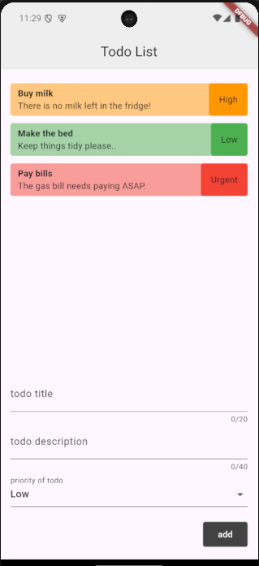

# Flutter Todo App

This is a simple Todo app built with Flutter, demonstrating the use of forms and form validation.

## Features

- Add new todos with a title, description, and priority
- View a list of all todos
- Todos are displayed with different background colors based on their priority

## Screenshots

## Getting Started

To get started with this project, follow these steps:

1.  Clone the repository:

    `git clone https://github.com/prime-infinity/flutter-todo.git`

2.  Navigate to the project directory:

    `cd flutter-forms-tutorial-starter-project`

3.  Install the dependencies:

    `flutter pub get`

4.  Run the app:

    `flutter run`

## Project Structure

The project has the following structure:

Copy

`flutter-forms-tutorial-starter-project/
├── lib/
│   ├── models/
│   │   └── todo.dart
│   ├── todo_list.dart
│   └── home.dart
│   └── main.dart
├── pubspec.yaml
└── README.md`

- `models/todo.dart`: Defines the `Todo` class, which represents a single todo item.
- `todo_list.dart`: Displays the list of todos.
- `home.dart`: Contains the main app screen, which includes the todo list and the form to add new todos.
- `main.dart`: The entry point of the application.

## Dependencies

This project uses the following dependencies:

- `flutter/material.dart`: The core Flutter library for building UI.

## Usage

1.  When the app is launched, you'll see the home screen with the list of existing todos.
2.  To add a new todo, fill out the form at the bottom of the screen:
    - Enter a title (required)
    - Enter a description (required, at least 5 characters)
    - Select a priority (low, medium, or high)
3.  Click the "Add" button to save the new todo.
4.  The new todo will be added to the list, with the background color reflecting its priority.

## Contributing

If you find any issues or have suggestions for improvements, feel free to open an issue or submit a pull request.

## Credits

This project was made by following iamshaunjp flutter forms tutorials
`https://github.com/iamshaunjp/flutter-forms-tutorial`
